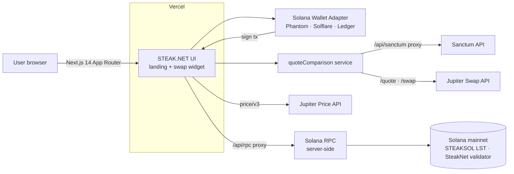
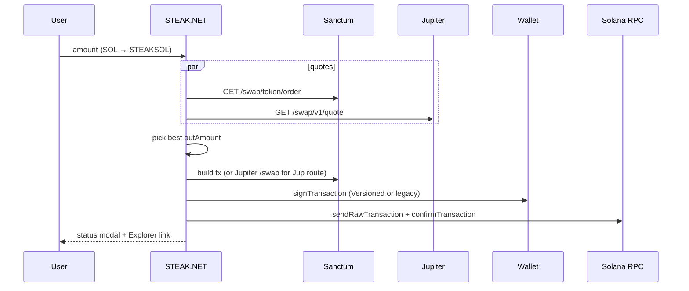

# 🥩 STEAK.NET: Liquid staking UI for STEAKSOL on Solana

**Stake SOL. Earn SOL. Earn STEAK.**

STEAK.NET is the web app for **STEAKSOL**, the liquid staking token (LST) of the SteakNet Solana validator. Users connect a Solana wallet, swap SOL (or another LST) into STEAKSOL in one transaction, and keep a liquid token whose exchange rate against SOL goes up as validator rewards build up each epoch.

🔗 **Live:** [https://steak.net](https://steak.net) · 📚 [Docs](https://steaknet.gitbook.io/steaknet/) · 💬 [Discord](https://discord.gg/steaknet) · 𝕏 [@steaknet](https://x.com/steaknet) · ✈️ [Telegram](https://t.me/steaknet)

<!-- TODO: add a screenshot, e.g. docs/screenshot.png -->

---

## Features

- **Landing page** (`/`) with a hero, a "What is STEAKSOL?" explainer (Stake → Receive STEAKSOL → Gather rewards), a `$STEAK` token section, community links, and Privacy Policy / Terms modals.
- **Swap widget built into the page.** The home page uses a compact selector (`LiquidSteakTokenSelectorCompact`). A full-page version (`LiquidSteakTokenSelectorEnhanced`) is available at `/steak`.
- **Best-quote routing.** The app asks for quotes from both **Sanctum** (`/swap/token/order`, routed through `Jup`, `SanctumRouter` and `Inf`) and **Jupiter** (`lite-api.jup.ag/swap/v1`), then picks the quote with the higher output amount. Default slippage is 50 bps.
- **LST discovery.** The token list comes from Sanctum's `/lsts` endpoint. SOL is the default input and STEAKSOL (`sctmqBfQtZj76PaLmepQ7Xskpu8LNMyWsXqFYAuihML`) is the default output.
- **Stake and unstake in both directions.** A direction toggle flips the swap between *token → STEAKSOL* and *STEAKSOL → token*. The same quote and routing pipeline is used both ways.
- **USD pricing.** SOL and STEAKSOL prices come from the Jupiter Price API v3, with a 5-second in-memory cache. If Jupiter has no STEAKSOL price, the app estimates it from the SOL price.
- **Wallets.** Phantom, Solflare and Ledger via `@solana/wallet-adapter`, with auto-connect, on Solana **mainnet-beta**.
- **Signing flow.** The app handles both versioned and legacy transactions and signs client-side (non-custodial). It sends with preflight and retries, then waits for `confirmed` commitment.
- **Transaction status modal** that tracks each stage (building → signing → sending → confirming → success/error) and links to Solana Explorer. Common failures, such as slippage `0x1789`, insufficient balance and simulation errors, are shown as readable messages.
- **Vercel Analytics** and custom local fonts (Steak font, Poppins, Geist).

## Architecture



Swap sequence:



This repository is **frontend only**. It has no backend and no database, and it does not include an on-chain program of its own.

## On-chain components

| Item | Value |
|---|---|
| STEAKSOL mint | `sctmqBfQtZj76PaLmepQ7Xskpu8LNMyWsXqFYAuihML` |
| Wrapped SOL | `So11111111111111111111111111111111111111112` |
| Cluster | mainnet-beta |

STEAKSOL is a Sanctum-infrastructure LST backed by stake delegated to the SteakNet validator. Minting and redeeming go through Sanctum's routers, so this app does **not** deploy or call any custom Anchor program.

## Tech stack

- **Framework:** Next.js 14 (App Router), React 18, TypeScript
- **Styling/UI:** Tailwind CSS v4, shadcn/ui (Radix primitives), lucide-react, glassmorphism theme. The initial design was generated with v0.
- **Solana:** `@solana/web3.js`, `@solana/spl-token`, `@solana/wallet-adapter-*`
- **Integrations:** Sanctum API, Jupiter Swap API and Price API v3
- **Hosting:** Vercel (with `@vercel/analytics`)
- **Browser polyfills:** crypto/stream/http/zlib fallbacks set in `next.config.mjs` for web3.js

## Getting started

### Prerequisites

- Node.js 18.17+ (required by Next.js 14)
- npm (the repo ships a `package-lock.json`)
- A Sanctum API key and, ideally, a dedicated Solana RPC endpoint

### Install & run

```bash
git clone https://github.com/kevan1/<repo>.git
cd <repo>
npm install
# create .env.local with the variables below
npm run dev        # http://localhost:3000
```

| Script | Command |
|---|---|
| `npm run dev` | `next dev` |
| `npm run build` | `next build` |
| `npm run start` | `next start` |
| `npm run lint` | `next lint` |

### Environment variables (`.env.local`)

| Name | Required | Purpose |
|---|---|---|
| `SANCTUM_API_KEY` | yes | Sanctum API (LST list, quotes, swaps). Used server-side in `/api/sanctum` proxy. |
| `SOLANA_RPC_URL` | recommended | RPC endpoint for server-side `/api/rpc` proxy. Falls back to public mainnet-beta cluster. |
| `ALLOWED_ORIGINS` | optional | Comma-separated allowed origins for RPC proxy (e.g., `https://example.com`). |

> ✅ **Security:** API keys are now server-side only. Client requests go through Next.js API routes (`/api/sanctum/...` and `/api/rpc`) that inject credentials on the server.

## Project structure

```
app/
  layout.tsx            # metadata, fonts, WalletContextProvider, Vercel Analytics
  page.tsx              # landing page + compact swap widget
  steak/page.tsx        # full-page swap widget
  globals.css
components/
  legal/LegalModal.tsx  # Privacy / Terms modal
  ui/                   # shadcn/ui primitives
content/legal/legalText.ts
src/
  components/           # LiquidSteakTokenSelector{Compact,Enhanced}, TransactionStatusModal, WalletContextProvider, ClientOnly
  hooks/                # useSwap, useTokenData, useUSDPrices
  services/             # sanctumApi, jupiterApi, quoteComparison, priceApi
  types/index.ts        # shared types + STEAKSOL constants
public/                 # fonts, favicon, images
next.config.mjs         # web3.js polyfills, image domains
```

## Roadmap / known gaps

- [ ] Serve landing-page stats ("SOL Staked", "Epochs Served", "Stakers") from on-chain or Sanctum data. They are currently hard-coded.
- [x] ~~Put the Sanctum API key and RPC URL behind a Next.js route handler so they are not shipped to the browser.~~ **(DONE: `/api/sanctum` and `/api/rpc` proxies)**
- [ ] Turn TypeScript and ESLint checks back on in builds (`ignoreBuildErrors` / `ignoreDuringBuilds` are currently `true`).
- [ ] Remove unused dependencies and files (`@remix-run/react`, duplicate `next.config.ts`, unused shadcn components). Pin `latest` versions.
- [x] ~~Add a `.env.example`~~ **(DONE)**
- [ ] CI (lint + build), and a few unit tests for `quoteComparison` and `priceApi`.
- [ ] Show validator APY in the UI (`sanctumApi.getValidatorAPY()` already exists but is not displayed).
- [ ] Add a screenshot and a license.

## Credits

Built by the SteakNet team. Initial design and landing page by DS (v0), and swap integration and Sanctum/Jupiter routing by Kevin Anrique ([@kevan1](https://github.com/kevan1)).
